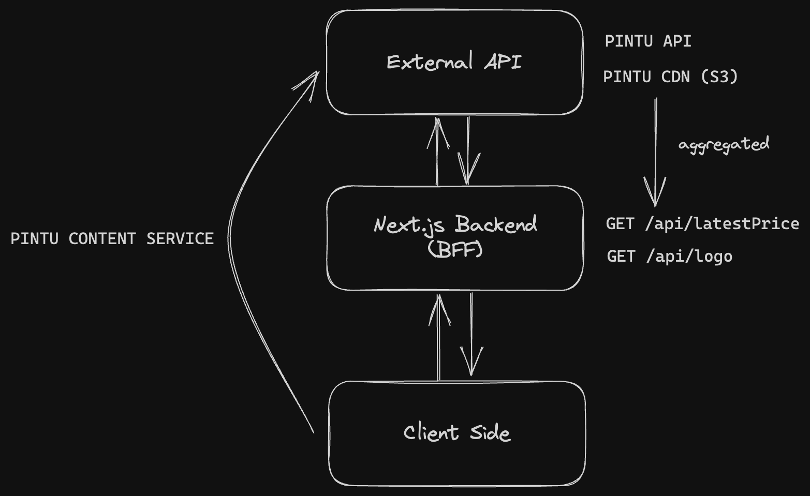

# Software Architecture Documentation

## Overview

This documentation provides an overview of the software architecture for a Next.js application that communicates with PINTU, a third-party service. The application utilizes two methods of communication: direct communication with the PINTU Content Service and communication through a proxy backend (Backend for Frontend - BFF) created using Next.js to interact with the PINTU API and PINTU CDN hosted at S3.

The primary purpose of the Backend for Frontend (BFF) is to aggregate data from the PINTU API, specifically the endpoints https://api.pintu.co.id/v2/trade/price-changes and https://api.pintu.co.id/v2/trade/price-changes. Additionally, the BFF acts as a means to bypass Cross-Origin Resource Sharing (CORS) restrictions when fetching data from the PINTU CDN.

## Architecture Diagram

## Next.js Application

The Next.js application is the frontend component of the system. It serves as the user-facing interface and interacts with both the Proxy Backend (BFF) and the PINTU Content Service. The application utilizes Next.js, a popular React framework, to provide server-side rendering and other performance optimizations.

## Proxy Backend (BFF)

The Proxy Backend, implemented using Next.js, acts as an intermediary between the Next.js application and the PINTU API and PINTU CDN. It serves as a Backend for Frontend (BFF) to aggregate data from the PINTU API endpoints, https://api.pintu.co.id/v2/trade/price-changes and https://api.pintu.co.id/v2/trade/price-changes. The BFF also handles communication with the PINTU CDN hosted at S3 to bypass CORS restrictions and fetch data for the Next.js application.

## PINTU Content Service (content.pintu.co.id)

The PINTU Content Service is a third-party service that provides content-related functionalities. The Next.js application directly communicates with this service to retrieve content as needed.

## PINTU API (api.pintu.co.id)

The PINTU API is the primary interface for accessing data and functionality provided by the PINTU platform. The Proxy Backend (BFF) communicates with the PINTU API endpoints to aggregate data for the Next.js application.

## PINTU CDN

The PINTU CDN, hosted at S3, serves as a content delivery network for assets used by the PINTU platform. The Proxy Backend (BFF) interacts with the CDN to fetch data required by the Next.js application. It also serves as a means to bypass CORS restrictions that may be enforced when directly fetching data from the CDN.

## Pros and Cons

| Pros                                                                      | Cons                                                                          |
| ------------------------------------------------------------------------- | ----------------------------------------------------------------------------- |
| Modularity                                                                | Increased complexity due to the Proxy Backend (BFF) layer                     |
| Performance optimization with server-side rendering                       | Additional resource consumption for running the BFF                           |
| CORS bypass for fetching data from PINTU CDN                              | Potential single point of failure with the BFF                                |
| Flexibility in data aggregation and transformation                        | Dependency on external services (PINTU Content Service, PINTU API, PINTU CDN) |
| Seamless integration with PINTU Content Service, PINTU API, and PINTU CDN | Development overhead for maintaining the BFF                                  |

## Conclusion

This documentation provided an overview of the software architecture for the Next.js application that communicates with PINTU. The application employs direct communication with the PINTU Content Service and utilizes a Proxy Backend (BFF) created using Next.js to interact with the PINTU API and PINTU CDN hosted at S3. The BFF acts as an aggregator of data from the PINTU API and enables bypassing CORS restrictions when fetching data from the PINTU CDN. Understanding this architecture will aid in the development and maintenance of the application.
